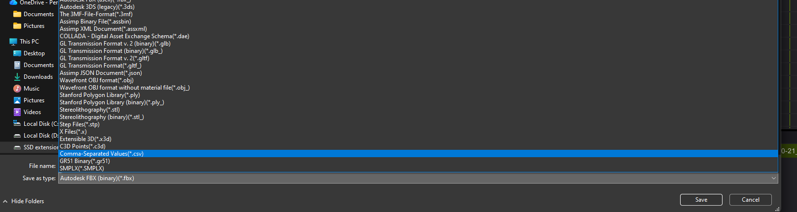
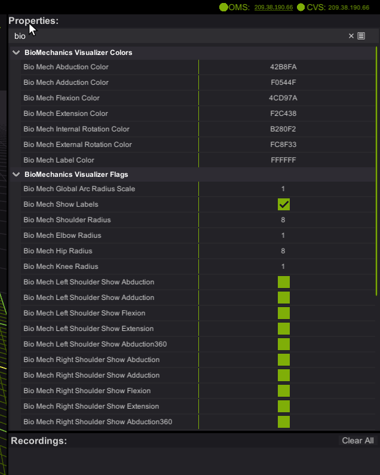
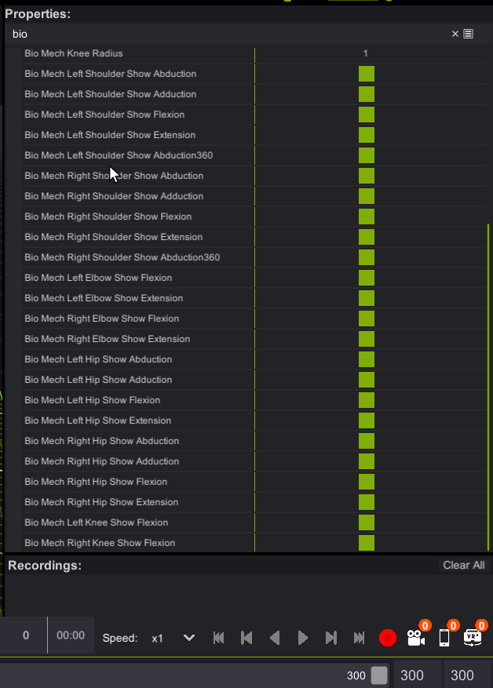

# Biomechanical Visualization & CSV Export in Mocap Studio

Mocap Studio includes built-in tools for visualizing joint angles and other biomechanical measurements directly inside the viewport.  
You can also export these biomechanical values into **CSV files**, one file per character recorded, for use in analysis, research, and external workflows.

This page explains how to export biomechanical data and provides a complete reference for all biomechanical visualization settings available in Mocap Studio.

---

# 1. Recording and Exporting Biomechanical Data

## 1.1 Recording Panel Overview

All recorded sessions appear in the **Recordings** panel.  
Each recording can be played, renamed, deleted � and exported.

Below is the location of the **Export** button:


---

## 1.2 Exporting to CSV

Click the **Export** button on any recorded session.  
This opens the Export dialog, where you select the desired file format:



### Export Behavior

- Mocap Studio exports **one CSV file per character** included in the recording.
- Each CSV contains **all biomechanical values shown in the Biomech Visualization panel**, sampled on every frame.
- Files are named based on the recording name, plus timestamp information.

CSV files can be used in:
- Excel, Google Sheets, Numbers  
- Python / Pandas workflows  
- MATLAB  
- Data science and research pipelines  
- Training machine learning models  
- Motion analysis tools  

---

# 2. Biomechanics Visualization Panel (Overview)

The Biomechanics panel appears in the **Properties** section of Mocap Studio.  
It lets you control how joint biomechanics are displayed in the viewport, including arc visibility, colors, radius scaling, and per-joint toggles.



These visualization tools help you inspect angles and ranges of motion in real time.

---

# 3. Visualization Settings

## 3.1 Color Controls

These colors define the arcs drawn in the viewport.  
Each represents a joint motion direction:

| Setting | Meaning |
|--------|---------|
| **Abduction Color** | Arm or leg moving away from the body midline. |
| **Adduction Color** | Arm or leg moving toward the body midline. |
| **Flexion Color** | Bending motion (e.g., lifting arm forward or bending the knee). |
| **Extension Color** | Straightening motion or backward motion. |
| **Internal Rotation Color** | Limb rotating toward the midline. |
| **External Rotation Color** | Limb rotating away from the midline. |
| **Label Color** | Color of numerical labels and text drawn near joints. |

These colors are also used in the CSV for column grouping and interpretation.

---

## 3.2 Global Display Options

| Setting | Description |
|---------|-------------|
| **Global Arc Radius Scale** | Scales the size of all biomechanical arcs in the viewport. |
| **Show Labels** | Toggles on/off numerical joint labels showing angle values. |

---

## 3.3 Joint Radius Controls

Adjusts the size of arcs for each joint region:

| Joint | Control |
|-------|---------|
| Shoulders | **Shoulder Radius** |
| Elbows | **Elbow Radius** |
| Hips | **Hip Radius** |
| Knees | **Knee Radius** |

Increasing radius helps separate arcs visually when multiple joints are active.

---

# 4. Joint-Specific Visualization Flags

These flags allow you to choose which biomechanical measurements are shown per joint.  
The screenshot below shows the full list of available toggles:



Each group has left/right side controls.

---

## 4.1 Shoulders

### Left and Right Shoulder Flags:
- **Show Abduction**
- **Show Adduction**
- **Show Flexion**
- **Show Extension**
- **Show Abduction360**

**Abduction360**  
Displays a full circular abduction range representation � useful for overhead and complex shoulder motion capture.

---

## 4.2 Elbows

### Left and Right Elbow Flags:
- **Show Flexion**
- **Show Extension**

Elbow measurements typically represent hinge motion.

---

## 4.3 Hips

### Left and Right Hip Flags:
- **Show Abduction**
- **Show Adduction**
- **Show Flexion**
- **Show Extension**

These appear around the pelvis and upper leg region.

---

## 4.4 Knees

### Left and Right Knee Flags:
- **Show Flexion**

(Extension is implicitly visualized in opposite direction of flexion.)

---

# 5. CSV Export Structure (Technical Reference)

A CSV file is created **per character** and contains the following:

### 5.1 Rows
Each row represents **one frame** of captured motion.

### 5.2 Columns
Columns correspond to each enabled biomechanical measurement:

Example column names:
```
LeftShoulder_Abduction
LeftShoulder_Flexion
RightElbow_Flexion
RightHip_Adduction
LeftKnee_Flexion
...
```

### 5.3 Interpreting Values
- Values are expressed in **degrees**.  
- Sign conventions match the arc directions in the viewport.  
- If a visualization flag is disabled, the value may still appear in CSV (depending on feature set).

---

# 6. Tips & Best Practices (Technical)

- Use **larger radius scales** when arcs overlap visually between joints.  
- When validating motion data, cross-check viewport values with CSV frames.  
- Import CSV into Python with `pandas.read_csv()` for advanced analysis.  
- In biomechanical research, combine CSV data with motion trajectories for joint torque estimation.  

---

# 7. File Locations & Naming

- CSV files export to the folder you select in the Export dialog.
- Filenames follow:  
  **`RecordingName_CharacterName_YYYYMMDD_HHMMSS.csv`**
- When exporting a session with multiple performers, expect multiple CSV files.

---

# 8. Summary

Mocap Studio�s biomechanical tools let you:
- Visualize joint angles in real time  
- Export per-character CSV files for analysis  
- Control exactly which angles and motions appear in the viewport  

These tools support animation workflows, QA pipelines, and scientific analysis, making Mocap Studio a powerful solution for biomechanical capture.

